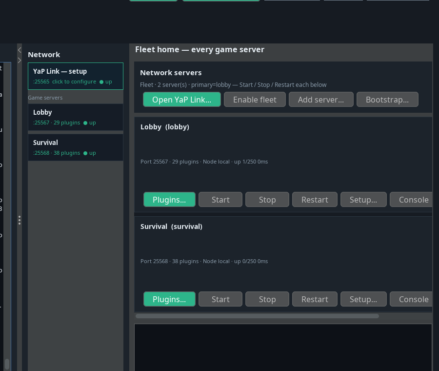
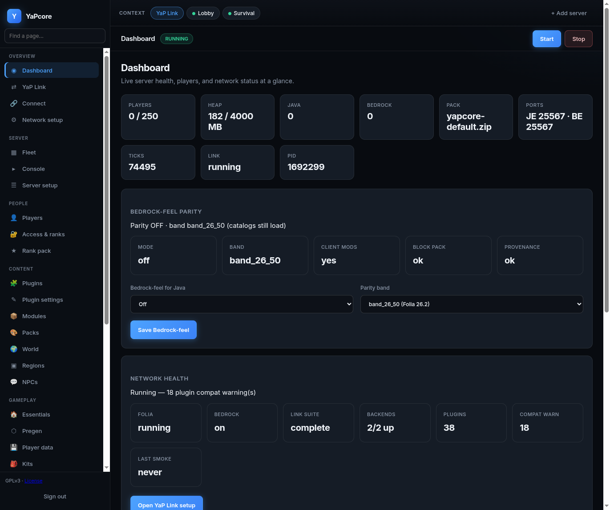
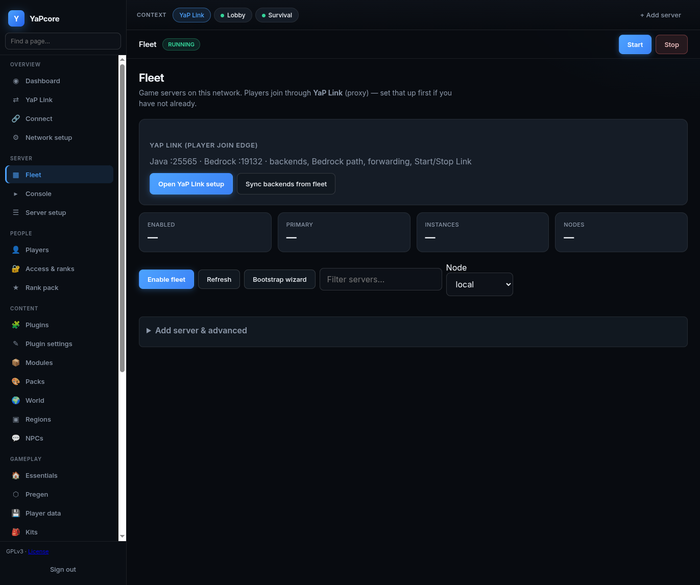

# YaPcore

<p align="center">
  
</p>

<p align="center">
  <strong>Production Folia network stack</strong> — Folia region ticks; YaP partition/carve aim at real splits without a second clock,<br/>
  dual-stack Java + Bedrock, first-party plugins, native proxy, Bedrock-feel parity, and operator tooling.
</p>

<p align="center">
  <a href="https://github.com/Xydroc-IO/YaPcore/releases/tag/0.0.0.1"></a>
  <a href="LICENSE"></a>
  
  
  <a href="docs/whitepaper/YAPCORE_WHITEPAPER.md"></a>
  <a href="docs/start/AI_TRANSPARENCY.md"></a>
  <a href="https://discord.gg/BXbyQk88Da"></a>
  <a href="https://ko-fi.com/xydroc"></a>
</p>

| | |
|--|--|
| **Install** | [Quick Start](docs/start/QUICK_START.md) · [0.0.0.1 prerelease](https://github.com/Xydroc-IO/YaPcore/releases/tag/0.0.0.1) |
| **Operators** | [Wiki](docs/README.md) · [Defaults](docs/start/DEFAULTS.md) · [Secrets](docs/start/SECRETS.md) |
| **Architecture** | [Whitepaper](docs/whitepaper/YAPCORE_WHITEPAPER.md) |
| **Crossplay** | [Crossplay](docs/network/CROSSPLAY.md) · [Bedrock-feel](docs/product/BEDROCK_FEEL_PARITY.md) · [YaP Link](docs/network/YAP_LINK.md) |
| **Performance** | [YaP-Folia](docs/folia/YAP_FOLIA_PATCHES.md) |
| **Help / contribute** | [Community & support](#community--support) · [Discord](https://discord.gg/BXbyQk88Da) · [CONTRIBUTING](CONTRIBUTING.md) |
| **Legal** | [GPLv3](LICENSE) · [Licensing](docs/start/LICENSING.md) · [AI transparency](docs/start/AI_TRANSPARENCY.md) · [Privacy](docs/start/PRIVACY_POLICY.md) · [Terms](docs/start/TERMS_OF_USE.md) |

> Independent project. Not affiliated with Mojang Studios, Microsoft, PaperMC, ViaVersion, or GeyserMC.

---

## Product

YaPcore is a **shippable Minecraft network product**, not a plugin mashup. Game authority runs on **YaP-Folia** (managed Folia 26.2 fork). The edge, dual-stack protocol path, web dashboard, and operator GUI sit on **YapEngine**. Multi-backend routing uses **YaP Link** with a **first-party Bedrock join path** (no Geyser / Via\* jars on the product path). CORE + NETWORK plugins are first-party — perms, chat, moderation, essentials, playerdata, packs, claims, Tailor presence, and more — so operators are not assembling a third-party jar list for a normal SMP or network.

| Capability | What you get |
|------------|----------------|
| **Regionized ticks** | YaP-Folia regions. **Professional bar:** the regionizer holds **real** splits (contiguous hot region → empty-buffer cut → independent Folia shards) **without** a YaP phase clock. Partition/carve knobs are on; that bar is **not yet proven** — [YAP_FOLIA_PATCHES.md](docs/folia/YAP_FOLIA_PATCHES.md) |
| **Mob AI budgets / µs chassis** | MSPT-gated **AI time-slice** + entity/hopper budgets on Folia; YapEngine orders bridge/plugin work in **µs** (`SequenceToken`) |
| **Crossplay** | Java (1.20.2+) + Bedrock on one product story — Link-native Bedrock join by default; Bedrock form hubs for `/menu`, kits, ranks, admin |
| **Bedrock-feel parity** | Convert-verified skins / emotes / movement / catalog blocks — [BEDROCK_FEEL_PARITY.md](docs/product/BEDROCK_FEEL_PARITY.md) |
| **Network** | YaP Link native proxy (`0.6.0-phase6`), Floodgate-class identity, dual-stack gateway |
| **Plugin suite** | First-party CORE + NETWORK; **Items + QoL** on by default; opt-in GAMEPLAY (skills / stacker / knobs / disasters / dungeons); opt-in Factions + Conquest |
| **Ops** | Web dashboard (`:8080`), Swing GUI, seed defaults, MariaDB / Postgres / SQLite paths, shared messages + reload UX |
| **Packs** | `yapcore-default.zip` / `.mcpack` from the **0.0.0.1** GitHub prerelease (`/releases/download/0.0.0.1/…`) |
| **Clients (optional)** | Fabric: visuals, bag, staff, ultrawide, **yap-presence**, **yap-blocks** — vanilla/Bedrock still join when parity mode is off |

**Docs:** [QUICK_START.md](docs/start/QUICK_START.md) · [RELEASE_NOTES.md](docs/start/RELEASE_NOTES.md).

Version line: **0.0.0.1** · YaP Link **0.6.0-phase6** · YaP-Folia **26.2** — see [RELEASE_NOTES.md](docs/start/RELEASE_NOTES.md).

### AI assistance (disclosure)

YaPcore is developed with the assistance of **AI coding tools**. Human maintainers remain accountable for review, security, and release quality. Full statement: **[AI_TRANSPARENCY.md](docs/start/AI_TRANSPARENCY.md)**.

### Screenshots

Live captures from a local fleet (lobby + survival + YaP Link). In-game / Bedrock shots welcome as PRs under [`docs/images/readme/`](docs/images/readme/).

<p align="center">
  
  <br/><em>Desktop Control Panel — fleet rail, per-server plugins, Start / Stop / Restart</em>
</p>

<p align="center">
  
  <br/><em>Web dashboard (:8080) — health cards, Bedrock-feel parity, network status</em>
</p>

<p align="center">
  
  <br/><em>Fleet page — YaP Link join edge + multi-backend controls</em>
</p>

### Capacity (YaP-Folia)

Honest product bars — not “unlimited players.” Scale is **regionized + multi-backend**, not one mega thread.

| Bar | Players | Meaning |
|-----|---------|---------|
| **Citeable MSPT (stable)** | **~100 active** | Fullcite ship profile vs stock Folia / Canvas — [YAP_FOLIA_PATCHES.md](docs/folia/YAP_FOLIA_PATCHES.md) |
| **Join verified** | **100 / 200** bots | Connection / routing checked; not a free MSPT blank check |
| **Network scale** | Multi-backend via **YaP Link** | Split worlds/lobbies across YaP-Folia jars; proxy fronts the fleet |
| **250 keepalive** | **Hold only** | Not a citeable ship claim — capacity testing, not marketing |

Practical SMP on one backend: tens to ~100 concurrent actives with ship knobs, LagGuard, and sane farms. Past that, add backends or tighten density knobs — [YAP_FOLIA_PATCHES.md](docs/folia/YAP_FOLIA_PATCHES.md) · [TUNE.md](docs/ops/TUNE.md).

### Parallel ticks (why it’s not “stock Folia”)

Classic Paper/Purpur keep one main world tick. Upstream Folia already regionizes: **one tick thread owns one region**. YaP-Folia adds force-partition + corridor carve so a **hot contiguous** area can become two Folia regions. That only holds if an empty buffer exists (`0017`) and stays empty (`0018`/`0019`). Cross-cut neighbors queue onto the owning region (`0015`) and may land on the next region tick — that is Folia, not a second clock.

**Professional bar (not met on 0.0.0.1):** carve a live contiguous loaded strip, `forcePartition` + `RegionizedWorldData.split`, gap holds under product view-distance, shards tick independently. No YaP epoch/microtick barrier required for that to be correct. Same-tick BLOCKS lockstep across shards **is** a second clock and is not the bar.

Aligned microticks (`0026`–`0030`) remain a ship knob for phase tagging / feel. They are **not** proof the regionizer held a real split. The lab partition-cut used pre-gapped lobes (`contiguous_carve=false`) — that is not a live contiguous cut.

| Knob (defaults) | Role |
|-----------------|------|
| `folia-subregion-partition=true` | Split hot regions into **parallel Folia shards** when an empty-buffer cut exists |
| `folia-subregion-carve=true` | Unload an empty corridor before the cut (`0018`) |
| `folia-regionizer-cut=true` | Native cut + ticket clamp so a packed spawn hole holds (`0041`) |
| `folia-grid-exponent=3` | 8-chunk sections — a VD=10 spawn has enough atoms to cut |
| `folia-aligned-microticks=true` | Optional micro/sub-tick phases + per-world waves — not the regionizer clock |
| `folia-micro-phases=4` | Phase count when aligned microticks on |
| `folia-tick-wave-max-wait-ms=2` | Soft per-world barrier max wait (must be &gt; 0) |
| `folia-physics-substeps=true` | N-step travel/move inside one tick (combat/feel; plugin tick stays 20 TPS) |
| `folia-microtick-budget-ms=8` | Soft **Mob AI time-slice** on hot regions (MSPT-gated; not a finer clock) |
| `folia-entity-tick-budget=400` | Cap Mob AI ticks per region when hot (≥12 ms MSPT) — never players / TNT / vehicles / bosses |
| `folia-hopper-tick-budget=64` | Soft-defer excess hopper transfers |

**Capacity in one hot area** comes from **real Folia shards after a legal cut** + budgets — not from spinning a faster world clock. Aligned phases are optional coherence; physics sub-steps improve movement/combat stability.

**YapEngine** (edge/chassis) sequences bridge and plugin work with **µs-resolution** `SequenceToken`s so I/O and menus stay ordered without owning the world heartbeat.

Citeable MSPT vs stock Folia / Canvas (ship knobs disclosed): [YAP_FOLIA_PATCHES.md](docs/folia/YAP_FOLIA_PATCHES.md) · soak profile: [YAP_FOLIA_PATCHES.md](docs/folia/YAP_FOLIA_PATCHES.md) · patch inventory: [YAP_FOLIA_PATCHES.md](docs/folia/YAP_FOLIA_PATCHES.md). We do **not** claim single-thread Paper MSPT victory. Re-verify after tick changes: `./scripts/yapctl cite-fullcite`.

---

## Get started

### Operators — download a release

1. Take **linux** or **windows** from the [0.0.0.1 prerelease](https://github.com/Xydroc-IO/YaPcore/releases/tag/0.0.0.1). GitHub **Latest** still points at stable **1.0.0.0**.
2. Unzip → `yapcore-release/linux` (or `windows`).
3. Configure secrets ([SECRETS.md](docs/start/SECRETS.md)), then launch:

```bash
# Linux
./start.sh --fg

# Windows
start.cmd -Fg
```

Join `127.0.0.1:25566` (Java + Bedrock). Dashboard: `http://127.0.0.1:8080/`

Also on the release: network / gameplay suites, `yapcore-default.zip` / `.mcpack`, and optional Fabric `client_mods.zip` (visuals, bag, staff, ultrawide, **presence**, **blocks**). Layout and rebuild: [RELEASES.md](docs/start/RELEASES.md).

### Developers — build from source

Requires **Java 25+**.

```bash
git clone https://github.com/Xydroc-IO/YaPcore.git && cd YaPcore
chmod +x scripts/*.sh scripts/db/*.sh scripts/yapctl
./scripts/build-yap-folia.sh          # → lib/yap-folia-26.2.jar
gradle installProductDefaults shadowJar
./scripts/seed-defaults.sh
./scripts/db/ensure-db.sh --server-id lobby
./scripts/start.sh --fg
```

Local release trees (gitignored):

```bash
./scripts/build-yap-folia.sh
./scripts/build-yap-client-render.sh
gradle publishReleasesFolder -PyapGameplay=true
# → releases/0.0.0.1/yapcore-release-{linux,windows}.zip
```

Slim CORE+NETWORK is the **default** (`yapGameplay=false`). Opt in to GAMEPLAY
(skills / stacker / items / knobs / disasters / dungeons): `gradle assembleRelease -PyapGameplay=true`.

Domain line gate: `gradle checkDomainLineLimits` (≤500 lines per first-party domain `.java`).

---

## Architecture

```text
┌─────────────────┐     ┌──────────────────┐     ┌─────────────────┐
│  YaP Link       │────▶│  YapEngine       │────▶│  YaP-Folia      │
│  multi-backend  │     │  edge · dual-stack│     │  regionized tick│
│  + Bedrock join │     │  dashboard · GUI  │     │  game authority │
└─────────────────┘     └──────────────────┘     └─────────────────┘
         │                        │
         │                        ▼
         │              first-party plugins/
         │              (CORE · NETWORK · GAMEPLAY)
         ▼
   yap-link-bedrock (native session / downstream)
```

| Layer | Role |
|-------|------|
| **YaP-Folia** | Game tick — build with `./scripts/build-yap-folia.sh` |
| **YapEngine** | Edge networking, dual-stack, I/O, dashboard, Swing GUI |
| **YaP Link** | Multi-backend proxy + **Link-native Bedrock** — [YAP_LINK.md](docs/network/YAP_LINK.md) · [YAP_LINK.md](docs/network/YAP_LINK.md) |
| **Plugins** | First-party stack under [`yap-first-party/`](yap-first-party/README.md) |

Default product path: `game-authority=folia`, `folia-jar-source=build`, Link **`bedrock-mode=native`**.

Deep dive: [YAPCORE_WHITEPAPER.md](docs/whitepaper/YAPCORE_WHITEPAPER.md) · join port notes: [CROSSPLAY.md](docs/network/CROSSPLAY.md).

---

## Shipped plugins (CORE + NETWORK)

| Jar | Role |
|-----|------|
| `yap-perms.jar` | Ranks, tracks, prefixes |
| `yap-chat.jar` | Channels, PM, filter, staff chat |
| `yap-moderation.jar` | Ban / mute / warn / kick + history |
| `yap-essentials.jar` | Spawn, tpa, fly, vanish, bag/economy cmds |
| `yap-playerdata.jar` | Cross-server data, economy, backpacks |
| `yap-db.jar` | Shared SQL pool (MariaDB / Postgres / SQLite) |
| `yap-packs.jar` | Multi-active resource packs |
| `yap-floodgate.jar` | Bedrock identity |
| `yap-bedrock-ui.jar` | Bedrock form hubs |
| `yap-tailor.jar` | Skins / wardrobe / emotes / presence channel |
| `yap-bedrock-blocks.jar` | Catalog Bedrock port-blocks for JE |
| `yap-folia-bridge.jar` | Folia scheduling bridge |

Full inventory: [PLUGINS.md](docs/plugins/PLUGINS.md) · [plugins/README.md](plugins/README.md).  
Optional Fabric clients: [`client/`](client/) — presence + blocks required only when `parity.bedrock-feel=true`.

---

## Documentation

Operator and engineering docs live under [`docs/`](docs/) (**Markdown is the source of truth**). Start from the [Wiki](docs/README.md). Optional local PDF prints: `./scripts/export-docs-pdf.sh` (gitignored under `docs/pdf/`).

| Audience | Start here |
|----------|------------|
| **Operators** | [QUICK_START](docs/start/QUICK_START.md) → [WIKI](docs/README.md) · [DEFAULTS](docs/start/DEFAULTS.md) |
| **Commands / perms** | [COMMANDS](docs/ops/COMMANDS.md) · [PERMISSIONS](docs/ops/PERMISSIONS.md) · [Dashboard](docs/ops/WEB_DASHBOARD.md) |
| **Network / packs** | [CROSSPLAY](docs/network/CROSSPLAY.md) · [CLIENTS_AND_PACKS](docs/network/CLIENTS_AND_PACKS.md) · [Bedrock-feel](docs/product/BEDROCK_FEEL_PARITY.md) |
| **Folia / capacity** | [YaP-Folia](docs/folia/YAP_FOLIA_PATCHES.md) |
| **Public edge** | [EDGE_HARDEN](docs/network/NETWORKING.md) · [SECRETS](docs/start/SECRETS.md) |
| **Architecture** | [Whitepaper](docs/whitepaper/YAPCORE_WHITEPAPER.md) |
| **Legal / AI** | [LICENSING](docs/start/LICENSING.md) · [AI transparency](docs/start/AI_TRANSPARENCY.md) |
| **Contributors** | [CONTRIBUTING](CONTRIBUTING.md) · [scripts/README](scripts/README.md) |

---

## Community & support

Bugs, operator help, and contributions are welcome. Prefer public GitHub issues for
non-security bugs so others can find the trail; use Discord for live help.

| Channel | Contact |
|---------|---------|
| **Email** | [xydroc@yaplabs.us](mailto:xydroc@yaplabs.us) |
| **Discord** | Username **xydroc** · server invite: [discord.gg/BXbyQk88Da](https://discord.gg/BXbyQk88Da) |
| **GitHub** | Issues / PRs on [Xydroc-IO/YaPcore](https://github.com/Xydroc-IO/YaPcore) · [CONTRIBUTING.md](CONTRIBUTING.md) |
| **Security** | Private only — [SECURITY.md](SECURITY.md) (email maintainers; do not file public issues for RCE/auth) |
| **Support the project** | [ko-fi.com/xydroc](https://ko-fi.com/xydroc) |


---

## Security

Report vulnerabilities privately — do **not** open a public issue for RCE, auth bypass, or pack-HTTP exposure. See [SECURITY.md](SECURITY.md).

Operators: keep secrets out of git ([SECRETS.md](docs/start/SECRETS.md)); put game and pack ports behind intentional firewall / nginx edges ([NETWORKING.md](docs/network/NETWORKING.md)).

---

## Contributing

See [CONTRIBUTING.md](CONTRIBUTING.md). One logical change per PR; keep build outputs, worlds, logs, and secrets out of the tree. Domain files under `src/main/java` and `yap-first-party/` must stay **≤500 lines**. AI-assisted patches are welcome when reviewed — [AI_TRANSPARENCY.md](docs/start/AI_TRANSPARENCY.md).

Questions before a PR: Discord ([invite](https://discord.gg/BXbyQk88Da), user **xydroc**) or email [xydroc@yaplabs.us](mailto:xydroc@yaplabs.us).

---

## License

**YaPcore** first-party source is **[GNU GPLv3](LICENSE)** (same family as Paper / Folia).

Minecraft (Mojang EULA), Faithful, Sodium (PolyForm Shield), YaP Iris (LGPL), and other bundled assets have separate terms — [LICENSING.md](docs/start/LICENSING.md). Branding marks: [branding/README.md](branding/README.md). AI use: [AI_TRANSPARENCY.md](docs/start/AI_TRANSPARENCY.md).
