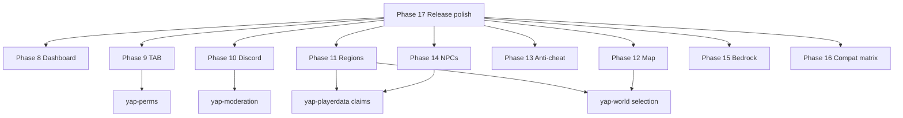

# YaPcore completion roadmap — phases for multi-agent split

**Goal:** Close every gap between “Folia-native network v1” and a **complete**
product that ~90% of survival/network operators expect — without relying on
LuckPerms, EssentialsX, CoreProtect, WorldEdit, Velocity, DiscordSRV, Dynmap,
TAB, WorldGuard, or random Paper plugins.

**Baseline (already shipped):** Phases 1–7 network stack, `installProductDefaults`,
YaP Link native suite, dashboard tabs for Ranks / Essentials / Link / Pregen /
Packs / Plugins. Backend APIs exist for Protect and World (`/api/protect`,
`/api/world`).

**Rules for every phase**

- Folia-safe: `folia-supported: true`, `YapSched` for world/block/entity work
- Shared DB via `yap-db` where persistence is needed
- Register services on `ServicesManager` when other plugins consume APIs
- Dashboard: match existing web UI patterns (`index.html`, `app.js`,
  `DashboardGameplayApi.java`)
- Docs: update `PERMISSIONS.md`, plugin `config.yml`, smoke script if applicable
- Gradle: add to `settings.gradle.kts`, `installProductDefaults`, `assembleRelease`
  when shipping a new jar

---

## Agent assignment map (recommended)

| Agent slot | Phases | Theme |
|------------|--------|-------|
| **Agent Ops-UI** | **8** | Dashboard completion (6 tabs) |
| **Agent Social** | **9**, **10** | TAB + Discord |
| **Agent World** | **11**, **12** | Regions/flags + Web map |
| **Agent Security** | **13** | Anti-cheat |
| **Agent Content** | **14** | NPCs / quests |
| **Agent Edge** | **15** | Bedrock play depth |
| **Agent Platform** | **16**, **17** | Plugin compat matrix + release polish |

Phases **8** and **15** can start immediately (no cross-deps). **9** needs Perms
(prefix API). **11** extends existing claims. **12** needs world list + Folia
chunk access. **13** is isolated. **14** extends playerdata NPC traders.

---

## Phase 8 — Dashboard ops completion (Ops-UI)

**Status:** Not started (API partial)  
**Depends on:** Nothing  
**Ships in:** `src/main/resources/web/*`, `DashboardGameplayApi.java`

### Deliverables

| Tab | API route | GET | POST actions |
|-----|-----------|-----|--------------|
| **Protect** | `/api/protect` | status, row counts, logging flags | reload, prune, lookup preview, rollback by id |
| **World** | `/api/world` | loaded worlds, schem folder, brush/undo stats | load, unload, reload, pregen bridge status |
| **Chat** | `/api/chat` | channels, slow mode, filter stats, relay on/off | reload, clearchat, toggle channel default |
| **Moderation** | `/api/moderation` | recent punishments summary, active bans/mutes count | lookup player, unban (console), reload |
| **Perms** | `/api/perms` | groups, tracks, online player effective perms sample | reload, applypack hint (delegate to ranks) |
| **Playerdata** | `/api/playerdata` | feature flags, economy on/off, claim count, sync status | toggle feature flags, reload |

### Acceptance

- All six tabs visible in dashboard nav; lazy-load on tab click
- Every POST returns `{ ok, command|note, result }` like Essentials/Link tabs
- Read-only works when game server stopped; mutating actions show clear error
- `docs/WEB_DASHBOARD.md` updated with route table

### Files (starting points)

- `src/main/java/com/yapcore/web/api/DashboardGameplayApi.java`
- `yap-first-party/core-network/*/config.yml` for snapshot readers (mirror
  `DashboardEssentialsSnapshot.java` pattern)

---

## Phase 9 — TAB / scoreboard / nametag polish (Social)

**Status:** ✅ Shipped (v1.0.0.0)  
**Depends on:** `yap-perms` (prefix/suffix/weight)  
**Ships as:** `yap-tab.jar` + optional `yap-tab-api`

### Scope

Replace common **TAB**, **NametagEdit**, **Scoreboard** plugin trio:

| Feature | Detail |
|---------|--------|
| Tab list | Header/footer, player sort by weight, afk/vanish suffix |
| Nametags | Per-group prefix/suffix via Adventure; respect vanish (essentials) |
| Scoreboard | Sidebar lines (TPS placeholder, balance, claim count via PAPI) |
| Boss bar | Optional welcome / event bar |
| Cross-server | Tab format sync via Link plugin message (optional v1.1) |

### API

```java
TabService.setHeaderFooter(Player, Component, Component);
TabService.refresh(Player); // on rank/vanish/afk change
```

Listen: `YaPPerms` meta changes, essentials vanish/afk, playerdata balance.

### Acceptance

- `/yaptab reload`, permissions `yaptab.admin`
- Works on Folia with 100+ online (no main-thread DB)
- PlaceholderAPI expansion `%yaptab_rank%`, `%yapdata_balance%`
- Finetune module optional in `finetune-modules/`

---

## Phase 10 — Discord bridge (Social)

**Status:** ✅ Shipped (v1.0.0.0)  
**Depends on:** `yap-moderation`, `yap-chat` (optional relay)  
**Ships as:** `yap-discord.jar` (backend) + optional `yap-link-plugin-discord` (proxy alerts)

### Scope

DiscordSRV-class **minimum viable**:

| Channel | Events |
|---------|--------|
| `#mod-log` | ban, tempban, mute, warn, kick (embed with actor, target, reason) |
| `#chat` (optional) | MC → Discord for global/staff channels; Discord → MC command `/discord say` |
| `#status` (optional) | Server up/down via webhook on YaPcore start/stop |

### Config

```yaml
webhooks:
  moderation: "https://discord.com/api/webhooks/..."
  chat: "..."
relay:
  mc-to-discord: true
  discord-to-mc: false  # v1 default off (spam risk)
```

### Acceptance

- No Discord bot token required for v1 (webhooks only)
- Async HTTP via `YapSched.async` / global scheduler — never block region tick
- Dashboard tab or Essentials-style config section (Phase 8 can add `/api/discord`)
- Smoke: mock webhook URL + unit test payload shape

---

## Phase 11 — WorldGuard-level region flags (World)

**Status:** Partial (claims in `yap-playerdata` — trust levels, build gate)  
**Depends on:** `yap-playerdata` claims DB  
**Ships as:** extend playerdata **or** `yap-regions.jar` consuming `ClaimService`

### Scope

Add **region flags** on claims (and optional admin regions `/region define`):

| Flag | Behavior |
|------|----------|
| `pvp` | Allow/deny player damage |
| `mob-damage` | Allow/deny mob damage to players |
| `build` | Block place/break (extends trust) |
| `interact` | Doors, buttons, levers |
| `entry` | Deny entry with message |
| `chest-access` | Container open |
| `fire-spread` | Fire / lava spread |
| `mob-spawning` | Natural spawn in claim |

### Commands

`/claim flag set <flag> <allow|deny>`, `/region`, `/rg` (admin cuboids reusing
world-plugin selection API)

### Integration

- `yap-world` selection service for admin regions
- `yap-protect` logs flag violations (optional)
- Folia: check flags in `EntityDamageEvent`, `BlockBreakEvent`, `PlayerMoveEvent`
  (entry) on **region** scheduler for the block location

### Acceptance

- Flags persist in MariaDB (`yap_claim_flags` or JSON column on claims)
- Document in `docs/PLAYERDATA.md` or new `docs/REGIONS.md`
- Default claim template configurable in config.yml

---

## Phase 12 — Web map (Dynmap / BlueMap class) (World)

**Status:** Not started  
**Depends on:** Folia world access, optional `yap-world` world list  
**Ships as:** `yap-map.jar` + static tiles served by YaPcore pack HTTP or map port

### Scope

| Slice | Deliverable |
|-------|-------------|
| **12a** | Flat map renderer — periodic chunk color scan, write PNG tiles |
| **12b** | Web UI — Leaflet or static HTML in `src/main/resources/map/` |
| **12c** | Live markers — online players, warps, claims overlay (optional) |
| **12d** | Dashboard embed — iframe tab “Map” → `/map/` |

### Technical

- Tile job on `YapSched.global` + per-chunk work on `YapSched.region`
- Storage: `map/tiles/<world>/<zoom>/<x>_<z>.png`
- Config: worlds, render interval, max height, hide chests (privacy)
- Do **not** require Dynmap/BlueMap jars

### Acceptance

- `./scripts/smoke-yap-map.sh` — renders 16×16 chunk sample
- Map reachable at `http://127.0.0.1:8081/map/` (or dedicated port)
- Document CPU cost + recommended render interval

---

## Phase 13 — Anti-cheat (Security)

**Status:** Not started  
**Depends on:** Nothing (integrates with moderation later)  
**Ships as:** `yap-guard.jar` + `yap-guard-api`

### Scope (v1 — heuristic, no ML)

| Check | Action |
|-------|--------|
| Fly / glide without permission | Flag → kick after N violations |
| Speed / timer | Movement delta vs allowed speed |
| Reach | Attack distance vs vanilla max |
| NoFall | Fall distance anomaly |
| Scaffold | block place rate + air placement |

### Design

- Per-player violation buffer; staff bypass perm `yapguard.bypass`
- Violations → `yapmod warn` integration or auto-kick
- All checks on **entity** scheduler for the player; no global iteration
- Configurable sensitivity; default lenient for SMP

### Acceptance

- `/yapguard status`, `/yapguard reload`, `/yapguard alerts`
- Zero TPS impact in idle test (benchmark note in docs)
- Optional Link relay: cheat alerts to proxy console
- **Not** claiming Matrix/Vulcan parity — document as “lightweight native AC”

---

## Phase 14 — Citizens / quest NPCs (Content)

**Status:** Partial (`NpcTraderService` in playerdata)  
**Depends on:** `yap-playerdata`, economy optional  
**Ships as:** extend playerdata **or** `yap-npcs.jar`

### Scope

| Feature | Detail |
|---------|--------|
| NPC spawn | `/npc create <id>`, skin, name, location persist |
| Dialogue | YAML trees: click → messages → choices → commands |
| Quests | Objectives: break block, kill mob, deliver item, visit warp |
| Rewards | money, items, rank temp grant via commands |
| Trader | Migrate existing `NpcTraderService` under unified API |

### API

```java
NpcService.spawn(NpcDefinition);
QuestService.progress(Player, QuestEvent);
```

### Acceptance

- Folia-safe: NPC interaction on entity scheduler
- Quest progress in MariaDB (`yap_quest_progress`)
- Example quest pack in `examples/yap-npcs/`
- GUI quest log in `/menu` or `/quests`

---

## Phase 15 — Bedrock play depth (Edge)

**Status:** **Done** (Phase 15 smoke + docs)  
**Depends on:** Phase 4 protocol stack  
**Ships in:** `src/main/java/com/yapcore/crossplay/*`, `yap-floodgate`, docs

### Scope (close remaining **Partial** rows in parity matrix)

| Area | Done when |
|------|-----------|
| Block break/place | BE survival actions match JE on same world |
| Inventory / crafting | Mobile UI parity for core recipes |
| Combat | Damage, projectiles, shields |
| Vehicles / boats | Basic mount sync (or explicit “unsupported” doc) |
| Commands | BE command source for essentials/chat subset |
| Floodgate skins / links | Username + UUID stable across servers |

### Acceptance

- `./scripts/smoke-bedrock-play.sh` — scripted break/place/chat/inventory
- Update [PHASE4_PROTOCOL.md](PHASE4_PROTOCOL.md) rows from Partial → Done
- Remove “play depth deepening” language from [FULL_RUNDOWN.md](FULL_RUNDOWN.md)
  when soak green

---

## Phase 16 — Plugin compatibility matrix (Platform)

**Status:** **Done**  
**Depends on:** Nothing  
**Ships in:** docs + dashboard Plugins tab enhancement

### Scope

| Deliverable | Detail |
|-------------|--------|
| Curated matrix | CSV/JSON: plugin name → Folia status (works / broken / native replacement) |
| Dashboard | Plugins tab shows “YaP native alternative” badge per known jar |
| Bridge expansion | Document which Bukkit calls compat bridge handles |
| `check-plugin-layout.sh` | Warn on known-bad jars (EssentialsX, LP, etc.) with replacement hint |

### Acceptance

- `docs/PLUGIN_COMPAT_MATRIX.md` with ≥50 common plugins classified
- No promise to run Paper plugins on Folia — clarity is the product

---

## Phase 17 — Release polish & bundle (Platform)

**Status:** **Done**  
**Depends on:** Phases 8–16 jars exist  
**Ships in:** `build.gradle.kts`, `assembleRelease`, docs

### Scope

| Item | Detail |
|------|--------|
| `yap-network-suite.jar` | Shadow bundle: optional one-drop for link plugins |
| Dashboard | “Network health” summary on Status tab |
| `installProductDefaults` | Include all new first-party jars |
| `FULL_RUNDOWN.md` | Sync roadmap completion |
| Smoke gate | `./scripts/smoke-network-full.sh` — all APIs + dashboard tabs |

### Acceptance

- Fresh clone → `gradle assembleRelease` → single zip runs network smoke
- All dashboard tabs documented in [WEB_DASHBOARD.md](WEB_DASHBOARD.md)

---

## Dependency graph



---

## Suggested execution order (calendar)

| Wave | Phases | Parallel? |
|------|--------|-----------|
| **Wave 1** | 8, 15, 16 | Yes — 3 agents |
| **Wave 2** | 9, 10, 13 | Yes — 3 agents |
| **Wave 3** | 11, 12, 14 | Yes — 3 agents (11 before 12d claims overlay) |
| **Wave 4** | 17 | Single agent after jars land |

---

## Completion definition (“100%”)

When all phases 8–17 are **Done**:

- [ ] Dashboard covers Protect, World, Chat, Mod, Perms, Playerdata, Map, Discord config
- [ ] No required third-party plugin for: perms, chat, mod, essentials QoL, homes,
      economy, claims+flags, protect, world edit, pregen, tab list, discord logs,
      lightweight AC, NPC quests, web map, crossplay play depth
- [ ] `assembleRelease` installs full stack; smoke scripts green
- [ ] Operator docs list only **optional** external plugins (minigames, custom content)

---

## Quick reference — new jars

| Phase | Jar | API module |
|-------|-----|------------|
| 9 | `yap-tab.jar` | `yap-tab-api` |
| 10 | `yap-discord.jar` | — |
| 11 | (playerdata or `yap-regions.jar`) | `yap-regions-api` if split |
| 12 | `yap-map.jar` | — |
| 13 | `yap-guard.jar` | `yap-guard-api` |
| 14 | (playerdata or `yap-npcs.jar`) | `yap-npcs-api` if split |
| 10 link | `yap-link-plugin-discord.jar` | — |

Phases 8, 15, 16, 17 ship no new game jars (core/dashboard/docs only).
