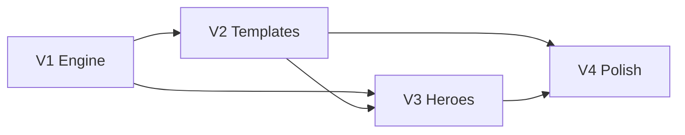

# YaP Ability VFX — quality upgrade (V1–V5)

**Goal:** Bring spell/ability visuals to top-MMO-plugin quality without abandoning Folia safety or the YAML ability packs.

**Depends on:** M6–M7 ability engine (`yap-abilities.jar`, `docs/mmo/MMO_ABILITIES.md`)

**Status:** ✅ **V1–V5 complete** (2026-09-04)

---

## Phase map

| Phase | Name | Status | Ships |
|-------|------|--------|-------|
| **V1** | Engine foundations | ✅ Done | `yap-abilities-api` + `yap-abilities.jar`, `showcase_vfx.yml` |
| **V2** | Template / generator overhaul | ✅ Done | `scripts/generate-ability-pack.py` + regenerated bulk YAML |
| **V3** | Hero ability art pass | ✅ Done | `showcase_heroes.yml` (12 signature casts) |
| **V4** | Polish & crossplay | ✅ Done | Status VFX, Bedrock names, unique hero icons, Folia soak gates |
| **V5** | No-egg + denser kit pass | ✅ Done | Hide hardening, `SNOWBALL` projectiles, denser VFX, 32×32 bulk icons |



**Rules (every phase)**

- World/entity work via `YapSched` only
- Respect `folia-safe.*` caps in `YaPAbilities/config.yml`
- Prefer declarative YAML over per-spell Java
- Do **not** hand-edit bulk generated packs at scale — change the generator (V2)
- Hand-author only hero/showcase abilities

---

## V1 — Engine foundations

**Status:** ✅ Done

| Feature | YAML | Runtime |
|---------|------|---------|
| Non-blocking timed steps | `at: N` | `EffectRunner` |
| Shake | `type: shake` | `ImpactFx` |
| Arc paths | `projectile.path: arc` | `ProjectileTracker` |
| Trail styles | `trail.style` + `falloff` | motion / ribbon / burst |
| Impact weight | `impact-shake` | staged nova + orb + shake |
| New shapes | `cone` `pillar` `orb` `shockwave` | `VfxEmitter` |

Showcase: `showcase_vfx.yml` · Tests: `AbilityPackLoaderVfxTest`

---

## V2 — Template / generator overhaul

**Status:** ✅ Done

- Script: `scripts/generate-ability-pack.py`
- Kits: fire / water / wind / earth / arcane / curse / prayer / melee / ranged / utility
- Regenerated **227** abilities; gameplay stats preserved
- Skips `showcase_*.yml`

```bash
python3 scripts/generate-ability-pack.py
python3 scripts/generate-ability-pack.py --dry-run
```

---

## V3 — Hero ability art pass

**Status:** ✅ Done · Pack: `abilities/showcase_heroes.yml`

| Id | School |
|----|--------|
| `inferno_meteor` | Fire |
| `tidal_collapse` | Water |
| `cyclone_rift` | Wind |
| `tectonic_spike` | Earth |
| `void_lance` | Arcane |
| `hex_bloom` | Curse |
| `solar_aegis` | Prayer |
| `blade_tempest` | Melee |
| `skyfall_volley` | Ranged |
| `phase_mirror` | Utility |
| `dragonfire_cascade` | Fire ultimate |
| `judgment_smite` | Melee / prayer |

---

## V4 — Polish & crossplay

**Status:** ✅ Done

| Item | Evidence |
|------|----------|
| Status-effect ambient VFX | `effects/common.yml` shaped/colored ticks |
| Folia projectile headroom + author notes | `config.yml` (`max-projectiles-per-player: 14`, global 112) |
| Bedrock cast labels with ability name | `AnimationSync` + `EffectRunner` |
| Unique hero icons (78020–78031) | `scripts/generate-hero-ability-icons.py` → pack textures/models |
| Folia VFX soak gate (offline) | `scripts/content/ability-vfx-soak-gate.py` + `AbilityVfxSoakGateTest` |

```bash
python3 scripts/generate-hero-ability-icons.py
python3 scripts/content/ability-vfx-soak-gate.py
gradle :abilities-plugin:test --tests 'com.yapcore.abilities.load.*'
```

Latest soak gate sample: **249** abilities · **486** timed `at:` steps · **283** shakes · **107** arcs · **156** motion/ribbon trails · shapes include cone/pillar/orb/shockwave · **PASS**

Optional live soak (when the game server is up): cast `inferno_meteor`, `void_lance`, `dragonfire_cascade` under multiplayer spam and confirm caps hold.

---

## V5 — No-egg + denser kit pass

**Problem:** Bulk melee/curse projectiles used `entity: EGG`. Hide often failed → visible egg projectiles with thin particle trails (“looks like an egg and no effects”).

**Ships**

| Change | Where |
|--------|--------|
| Stronger projectile hide (`setVisibleByDefault`, invisible, per-viewer `hideEntity`) | `ProjectileTracker` |
| Larger default display / cast icon scales (~1.15 / 0.55) | `ProjectileSpec`, `AbilityGraphics`, YAML `scale` |
| Generator: `EGG` → `SNOWBALL`, denser cast/hit/trail kits, sustained ticks | `scripts/generate-ability-pack.py` |
| 32×32 bulk ability icons (hero art preserved) | `scripts/generate-mmo-icons.py` |
| Live Folia data dir synced from regenerated packs | `folia-kernel/plugins/YaPAbilities/abilities/` |

```bash
python3 scripts/generate-ability-pack.py
python3 scripts/generate-mmo-icons.py
YAP_INCLUDE_VEHICLES=1 ./scripts/build-default-resourcepack.sh
# zip yap-abilities if delivered separately; then:
gradle :abilities-plugin:installIntoPlugins
# copy regenerated YAMLs into plugins/YaPAbilities/abilities/ (or /yapabilities reload)
```

**Verify in-game:** cast `melee_slash_1` / a curse — no egg, visible CMD icon display + denser dust/END_ROD trail. Re-accept resource pack after SHA change.

---

## V1 YAML cheat sheet

```yaml
cast:
  - type: animation
    style: cast
  - type: vfx
    particle: FLAME
    shape: helix
  - type: vfx
    at: 4
    particle: DUST
    shape: ring
    color: 255,80,20
  - type: shake
    power: 0.08
    pulses: 2

projectile:
  entity: SNOWBALL
  path: arc
  arc-height: 2.2
  hide: true
  impact-shake: true
  trail:
    particle: FLAME
    count: 6
    interval: 1
    style: motion
    falloff: 0.55

on-hit:
  - type: damage
    style: magic
    max-hit: 10
  - type: vfx
    particle: LAVA
    shape: shockwave
    count: 20
    radius: 2.0
  - type: shake
    power: 0.2
    pulses: 3
```

**Shapes:** `burst` · `ring` · `helix` · `beam` · `nova` · `cone` · `pillar` · `orb` · `shockwave`
