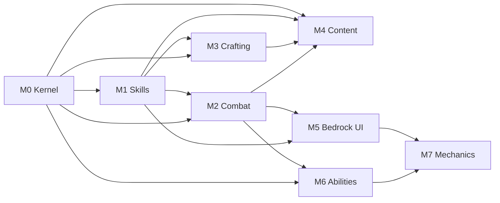

# YaP MMO — multi-agent phase plan (M0–M4)

**Goal:** Ship a first-party, Folia-native **RuneScape-style progression stack** on YaPcore:
skills, levels, XP curves, custom combat, crafting loops, quests/bosses — integrated with
existing `yap-playerdata`, `yap-npcs`, `yap-tab`, YaPDB, and Link.

**Not in scope for M0–M4:** Bedrock skill UI parity, full RS quest count, PvP minigames
(use future `yap-games`), factions (future `yap-factions`).

**M5–M7 (extended):** Bedrock MMO UI (M5), ability engine + 230+ combat abilities (M6), rich cast VFX + dedicated `CLAY_BALL` skill/ability icons (M7).
See `docs/mmo/MMO_BEDROCK_UI.md` and `docs/mmo/MMO_ABILITIES.md`.

**Global rules (every milestone)**

- `folia-supported: true` in every new `plugin.yml`
- World/block/entity work via `com.yapcore.sched.YapSched` only
- DB via shared YaPDB (`use-shared-yapdb: true`) — same pattern as `playerdata-plugin`
- Register public APIs on Bukkit `ServicesManager` (`ServicePriority.Normal`)
- Gradle: add modules to `settings.gradle.kts`, wire `installProductDefaults` +
  `assembleRelease` when shipping jars
- Permissions: document in `docs/ops/PERMISSIONS.md`
- Smoke / validate: `./scripts/validate-mmo-content.sh` (+ optional `smoke-folia-plugins.sh`)

> **Acceptance checklists** under each milestone are **manual QA** for operator sign-off.
> Milestones M0–M7 are **shipped** (code + automated gates); tick boxes after live soak.

**Reference implementations**

| Pattern | Copy from |
|---------|-----------|
| API jar | `yap-first-party/api/yap-npcs-api/` |
| Plugin + shadow + Hikari | `yap-first-party/core-network/npcs-plugin/` |
| Job XP / level DB | `playerdata-plugin/.../JobRepository.java` |
| Quest packs | `npcs-plugin/.../quest/QuestPackLoader.java` |
| GUI menus | `playerdata-plugin/.../gui/Menus.java` |
| Dashboard snapshot | `DashboardEssentialsSnapshot.java` |

---

## Agent assignment map

| Agent | Milestone | Theme | Depends on |
|-------|-----------|-------|------------|
| **Agent MMO-Kernel** | **M0** | Skill engine + Mining end-to-end | Nothing |
| **Agent MMO-Skills** | **M1** | 8 skills + `/skills` GUI + TAB | M0 merged |
| **Agent MMO-Combat** | **M2** | Custom combat, gear, food/pots | M0 merged; M1 combat XP hooks |
| **Agent MMO-Craft** | **M3** | Smithing/cooking/crafting + economy | M0 + M1 |
| **Agent MMO-Content** | **M4** | Quests v2, bosses, areas, hiscores | M0–M3 |

**Parallelism:** M2 and M3 can start once **M0 is merged** if they stub against
`SkillService` / `CombatService` interfaces from M0. Full integration tests need M1.

---

## Module layout (created incrementally)

```
yap-first-party/api/yap-mmo-api/          # M0 — interfaces + records
yap-first-party/api/yap-abilities-api/    # M6 — ability + status effect API
yap-first-party/api/yap-bedrock-ui-api/   # M5 — Bedrock form/action bar API
yap-first-party/gameplay/skills-plugin/   # M0–M1 — yap-skills.jar
yap-first-party/gameplay/combat-plugin/   # M2 — yap-combat.jar
yap-first-party/gameplay/crafting-plugin/ # M3 — yap-crafting.jar
yap-first-party/gameplay/mmo-content-plugin/ # M4 — yap-mmo-content.jar
yap-first-party/gameplay/abilities-plugin/   # M6–M7 — yap-abilities.jar
yap-first-party/gameplay/mmo-bedrock-plugin/ # M5 — yap-mmo-bedrock.jar
yap-first-party/core-network/bedrock-ui-plugin/ # M5 — yap-bedrock-ui.jar
```

Gradle project names (suggested):

- `:yap-mmo-api` → `yap-mmo-api.jar`
- `:skills-plugin` → `yap-skills.jar`
- `:combat-plugin` → `yap-combat.jar`
- `:crafting-plugin` → `yap-crafting.jar`
- `:mmo-content-plugin` → `yap-mmo-content.jar`

Ship M0–M1 under **`installGameplayDefaults`** (opt-in gameplay). M2–M4 same bucket.

---

## M0 — Skill engine kernel (one skill: Mining)

**Status:** ✅ Shipped (M0)

### Objective

Prove the full loop: **config skill → action → XP → level-up → DB persist → GUI read →
quest reward hook** using **Mining only**.

### Deliverables

#### 1. `yap-mmo-api`

```java
// Core types (package com.yapcore.mmo)
SkillId, SkillDefinition, XpTable, SkillProgress, LevelUpEvent
SkillService {
  CompletableFuture<SkillProgress> get(UUID, SkillId);
  CompletableFuture<Void> addXp(UUID, SkillId, double amount, XpSource source);
  int levelForXp(SkillId, double xp);
  double xpForLevel(SkillId, int level);
  Collection<SkillDefinition> definitions();
}
XpSource { action, quest, admin, command }
```

- XP table: RS-style exponential curve in YAML (`base-xp`, `growth`, `max-level: 99`)
- Event: `SkillLevelUpEvent` (Bukkit) for TAB/combat plugins

#### 2. `yap-skills` plugin

| Area | Detail |
|------|--------|
| DB | Table `yap_skill_progress (uuid, skill_id, xp, level, updated_at)` |
| Config | `skills/mining.yml` — break map `Material → xp`, optional level gates |
| Listener | `BlockBreakEvent` (MONITOR) — ore types grant mining XP; region-safe |
| Commands | `/skills [player]`, `/skill addxp <player> <skill> <amount>`, `/yskills reload` |
| GUI | Chest menu: one row per skill (M0: only Mining slot live) |
| Feedback | Action bar on XP drip; title/chat on level-up |
| PAPI | `%yapskill_<id>_level%`, `%yapskill_<id>_xp%`, `%yapskill_total_level%` (total=sum) |
| Services | Register `SkillService` on enable |

#### 3. Integration stub (M0 minimal)

- **npcs:** Add quest reward token `skill_xp:mining:500` in `QuestServiceImpl.dispatchRewards`
  (compileOnly `yap-mmo-api`; no-op if skills jar absent)
- **playerdata:** Document that legacy `jobs.miner` stays off when skills enabled; do not merge job XP yet

#### 4. Smoke + tests

- Unit: `XpTableTest` — level 1, 50, 99 boundaries
- Unit: `MiningXpCalculatorTest` — material map
- Script: `scripts/validate-mmo-content.sh` — compile, run unit tests, `SKIP_LIVE=1` boot check

### Acceptance

- [ ] Break iron ore → mining XP increases in DB within 2s
- [ ] Level-up fires `SkillLevelUpEvent` and shows player feedback
- [ ] `/skills` shows Mining level + XP bar
- [ ] `/skill addxp` works with `yapskills.admin`
- [ ] Reload does not duplicate listeners
- [ ] All block checks use `YapSched`; DB on async executor
- [ ] `gradle :skills-plugin:installIntoPlugins` + gameplay install puts jar in `plugins/`

### Agent prompt (copy-paste)

```
Implement YaP MMO Phase M0 per docs/mmo/MMO_PHASES.md.
Create yap-mmo-api + skills-plugin (Mining only). Folia-safe YapSched.
DB table yap_skill_progress, SkillService on ServicesManager, /skills GUI,
BlockBreakEvent XP, PAPI placeholders, `validate-mmo-content.sh`.
Extend yap-npcs quest rewards with skill_xp:mining:N (soft dependency).
Do not implement other skills yet. Match npcs-plugin Gradle/shadow patterns.
```

### Key files to create

- `yap-first-party/api/yap-mmo-api/src/main/java/com/yapcore/mmo/SkillService.java`
- `yap-first-party/gameplay/skills-plugin/src/main/java/com/yapcore/skills/SkillsPlugin.java`
- `yap-first-party/gameplay/skills-plugin/src/main/resources/skills/mining.yml`
- `scripts/validate-mmo-content.sh`

---

## M1 — Eight skills + progression UI

**Status:** ✅ Shipped (M1)  
**Agent:** MMO-Skills  
**Depends on:** **M0 merged**  
**Ships:** Updated `yap-skills.jar`, finetune module optional

### Objective

Expand kernel to **8 RuneScape-style skills** with shared XP tables, requirements, and
network-visible progression (TAB + dashboard read-only).

### Skills (v1 set)

| Skill | XP sources |
|-------|------------|
| **Mining** | (M0) ore break |
| **Woodcutting** | log break |
| **Fishing** | fish catch (`PlayerFishEvent`) |
| **Cooking** | smelt/craft cooking recipes (simple: cook raw food in furnace click or custom) |
| **Smithing** | smelt bars + basic smith actions (prep for M3; grant XP on bar smelt only in M1) |
| **Attack** | mob damage dealt (stub multiplier until M2 combat) |
| **Strength** | mob damage dealt (split XP 50/50 with Attack for now) |
| **Defence** | damage taken from mobs |
| **Hitpoints** | 1/3 combat XP to HP (RS-style ratio placeholder) |

Use **config-driven** skill defs: `skills/*.yml` one file per skill.

### Deliverables

| Area | Detail |
|------|--------|
| Listeners | Woodcut, Fish, FurnaceExtract/Smelt (cooking/smithing), EntityDamageByEntity, EntityDamageEvent |
| Requirements | `SkillRequirement` — `requires: { mining: 15 }` on skill actions (config) |
| Commands | `/skill top <skill> [page]`, `/skill set <player> <skill> <level>` |
| GUI | Full `/skills` — 8 icons, progress bars (item meta or Adventure boss bar in menu) |
| TAB | Listen `SkillLevelUpEvent` → refresh sidebar; placeholders for combat level |
| Combat level | Formula in config: `floor((attack+strength+defence+hitpoints)/4)` display only |
| Dashboard | GET `/api/mmo` snapshot: skill count, online sample levels (read-only) |
| Docs | `docs/mmo/MMO_SKILLS.md` — skill list, XP sources, permissions |

### Acceptance

- [ ] Each skill gains XP from its documented action at least once (manual test checklist in doc)
- [ ] Level requirements block action with clear message (e.g. mine mithril needs 55 mining — use config test ore)
- [ ] `/skill top mining` returns DB leaderboard (paginated, async)
- [ ] TAB sidebar updates on level-up
- [ ] Dashboard `/api/mmo` returns JSON without server crash when skills plugin loaded
- [ ] `scripts/validate-mmo-content.sh` passes

### Agent prompt

```
Implement YaP MMO Phase M1 per docs/mmo/MMO_PHASES.md on top of merged M0.
Add 7 more skills (woodcutting, fishing, cooking, smithing smelt XP, attack, strength,
defence, hitpoints). Config-driven skills/*.yml, /skill top, full /skills GUI,
combat level display, TAB refresh on SkillLevelUpEvent, dashboard GET /api/mmo.
Do not implement custom damage formulas (M2). Folia-safe throughout.
```

---

## M2 — Custom combat system

**Status:** ✅ Shipped (M2)  
**Agent:** MMO-Combat  
**Depends on:** **M0 merged**; **M1** for combat skill XP hooks  
**Ships:** `yap-combat.jar`  
**Docs:** [MMO_COMBAT.md](MMO_COMBAT.md)

### Objective

Replace vanilla mob PvE math with **configurable combat**: accuracy, max hit, defence,
gear bonuses, food, potions. Feed Attack/Strength/Defence/Hitpoints XP from M1.

### Deliverables

#### `yap-mmo-api` extensions

```java
CombatService {
  CombatStats stats(Player);
  void recalculate(Player); // on equip, buff expiry
}
CombatStats { attack, strength, defence, hitpoints, prayer, ranged, magic } // prayer/ranged/magic stubs 1-99 from gear only
GearBonus { attackBonus, strengthBonus, defenceBonus, ... } // aggregated from item NBT or config material map
```

#### `yap-combat` plugin

| Area | Detail |
|------|--------|
| Hit pipeline | `EntityDamageByEntityEvent` — cancel vanilla, apply formula damage on entity thread |
| Formula | Config: `maxHit = floor((strength + gear) * levelFactor)`; hit roll vs defence |
| Gear | `items.yml` — material → bonuses; optional PDC key `yap_gear_tier` for custom items |
| Food | Right-click food → heal HP (custom HP bar separate from vanilla 20 hearts OR scale 10 HP = 1 heart) — **pick one in config** |
| Potions | 2–3 boost types (attack pot, strength pot, defence pot) — duration + cooldown in config |
| Death | RS-lite: keep inventory config flag; respawn at spawn; HP restore |
| PvP | Config off by default; claim flag `pvp-combat: allow` hooks into `yap-playerdata` claims |
| XP | On kill: split XP to combat skills via `SkillService.addXp` |
| Commands | `/combat stats`, `/combat reload`, `/yapcombat admin sethp <player> <hp>` |

#### Integration

- **guard-plugin:** Optional — ignore players with combat invuln admin flag
- **npcs:** Boss entities tagged via PDC `yap_boss_id`

### Acceptance

- [ ] Zombie fight uses custom damage; vanilla sword spam DPS changes with strength level
- [ ] Equipping iron → diamond armor changes defence and reduces hits taken
- [ ] Food heals custom HP; cannot spam (tick delay)
- [ ] Potion buff visible in `/combat stats`
- [ ] Combat XP awards on mob kill match M1 ratios
- [ ] Folia: no cross-region entity mutation without `YapSched.entity`
- [ ] `scripts/validate-mmo-content.sh` — unit tests for hit formula + compile boot

### Agent prompt

```
Implement YaP MMO Phase M2 per docs/mmo/MMO_PHASES.md.
Create yap-combat.jar + CombatService API. Custom PvE damage pipeline, gear bonuses from
config, food + 3 potions, custom HP model (document choice), combat XP via SkillService.
PvP off default. Folia-safe YapSched. Unit tests for damage formula.
```

---

## M3 — Crafting & economy loops

**Status:** ✅ Shipped (M3)  
**Agent:** MMO-Craft  
**Depends on:** **M0 + M1**  
**Ships:** `yap-crafting.jar`  
**Docs:** crafting recipes in `plugins/YaPCrafting/recipes/`

### Objective

Close the **gather → process → equip** loop: smithing bars → items, cooking fish,
recipe unlocks by level, shop/AH hooks.

### Deliverables

| Area | Detail |
|------|--------|
| Recipe engine | YAML recipes: `id, type: SMITHING|COOKING|CRAFTING, level, inputs[], output, xp` |
| Stations | Anvil / furnace / crafting table interact — match recipe by ingredients + skill level |
| Smithing | Full bar → tool/armor tier progression (config tiers aligned with combat gear in M2) |
| Cooking | Raw fish → cooked; burn chance below level threshold |
| Unlocks | `/recipe list <skill>`, action bar on discover |
| Economy | Sell prices in config; optional `/sell` hand-in (uses playerdata `BalanceStore` via API) |
| NPC traders | Extend `yap-playerdata` traders OR crafting shop GUI for test NPC |
| AH | List crafted gear on playerdata auctions (if `features.auctions: true`) — document only if not wired |

### Acceptance

- [ ] Mine ore (mining) → smelt bar (smithing XP) → smith dagger (smithing XP + item with gear stats for M2)
- [ ] Fish → cook → eat (fishing + cooking XP loop)
- [ ] Recipe blocked below required level with message citing required level
- [ ] `/sell` adds money when economy enabled
- [ ] `scripts/validate-mmo-content.sh` — recipe parser unit tests + boot

### Agent prompt

```
Implement YaP MMO Phase M3 per docs/mmo/MMO_PHASES.md.
Create yap-crafting.jar with YAML recipe engine (smithing, cooking, crafting), station
listeners, level gates, /recipe list, /sell via playerdata BalanceStore.
Integrate gear output with yap-combat items.yml tiers. Folia-safe.
```

---

## M4 — Content layer (quests, bosses, areas, hiscores)

**Status:** ✅ Shipped (M4)

### Objective

Ship **playable content** on top of systems: extended quests, 3 boss fights, 2
skill areas, global hiscores, optional world markers.

### Deliverables

#### Quest system v2 (extend `yap-npcs`)

New objective types in quest packs:

| Type | Example |
|------|---------|
| `SKILL_LEVEL` | `mining >= 20` |
| `CRAFT_ITEM` | craft `iron_dagger` |
| `KILL_BOSS` | kill boss `goblin_king` |
| `GATHER` | (existing break/kill) |

Rewards: `skill_xp`, `item`, `money`, `unlock_recipe`, `teleport_unlock`

#### Boss module (in content plugin or combat)

- 3 bosses in YAML: stats, spawn location, loot table, respawn timer
- PDC tag `yap_boss_id`; combat plugin damage rules apply
- Loot: custom gear pieces for M2 tiers

#### Skill areas

- **Mining guild zone** — flag region + ore respawn nodes (regenerating ore facade: stone → ore on timer)
- **Fishing spot** — higher XP rate in tagged water region (RegionInteract from `yap-regions` or cuboid in config)

#### Hiscores

- `/hiscores <skill>` — top 50 global (DB query async)
- Link broadcast optional: level 99 announcements
- Dashboard tab **MMO** (extend M1): hiscore preview, boss kill counts

#### Content pack

Ship `plugins/yap-mmo-content/quests/starter_chain.yml` — 5-quest chain teaching loop

### Acceptance

- [ ] Complete starter quest chain grants ≥500 XP across 2 skills + one recipe unlock
- [ ] One boss killable with M2 combat; drops usable gear
- [ ] Mining guild ore respawns after configured delay
- [ ] `/hiscores mining` works cross-restart
- [ ] `scripts/validate-mmo-content.sh` — quest parser tests + full `SKIP_LIVE=1` boot with all MMO jars

### Agent prompt

```
Implement YaP MMO Phase M4 per docs/mmo/MMO_PHASES.md.
Create yap-mmo-content.jar: quest v2 objectives (extend yap-npcs quest packs),
3 bosses, 2 skill areas, /hiscores, starter_chain.yml content pack, dashboard MMO tab
hiscore preview. Depends on yap-skills, yap-combat, yap-crafting. Folia-safe.
```

---

## M5 — Bedrock MMO UI

**Status:** ✅ Shipped (M5)  
**Ships:** `yap-bedrock-ui.jar`, `yap-mmo-bedrock.jar`  
**Docs:** [MMO_BEDROCK_UI.md](MMO_BEDROCK_UI.md)

FormService skills hub, paginated recipes/hiscores, XP action bar mirror, combat sidebar.
Smoke: `scripts/validate-mmo-content.sh`

---

## M6 — Ability engine (230+ combat abilities)

**Status:** ✅ Shipped (M6)  
**Ships:** `yap-abilities-api.jar`, `yap-abilities.jar`  
**Docs:** [MMO_ABILITIES.md](MMO_ABILITIES.md)

YAML-driven abilities: projectiles, VFX, buffs/debuffs, cooldowns, `/ability`, `/cast` delegation.
Smoke: `scripts/validate-mmo-content.sh`

---

## M7 — Advanced mechanics + client graphics

**Status:** ✅ Shipped (M7)  
**Ships:** updated `yap-abilities.jar`, `yap-mmo-bedrock.jar`, `resourcepacks/yap-abilities/` overlay

AoE, homing projectiles, chain lightning, cast conditions, animation sync, blaze-rod spell icons,
Bedrock spellbook panel. Smoke: `scripts/validate-mmo-content.sh`

---

## Cross-milestone checklist (release manager)

After **M7**, run full integration:

```bash
`./scripts/validate-mmo-content.sh`
`./scripts/validate-mmo-content.sh`
`./scripts/validate-mmo-content.sh`
`./scripts/validate-mmo-content.sh`
`./scripts/validate-mmo-content.sh`
`./scripts/validate-mmo-content.sh`
`./scripts/validate-mmo-content.sh`
`./scripts/validate-mmo-content.sh`
YAP_GAMEPLAY=1 ./scripts/smoke-folia-plugins.sh   # if extended for gameplay jars
```

Update:

- `docs/overview/FULL_RUNDOWN.md` — MMO section
- `docs/ops/PERMISSIONS.md` — `yapskills.*`, `yapcombat.*`, `yapcraft.*`, `yapmmo.*`, `yapabilities.*`
- `gradle/yap-product.gradle.kts` — gameplay install includes all MMO jars
- `gradle/yap-release.gradle.kts` — release artifact list
- `docs/mmo/MMO_PHASES.md` — milestone status

---

## Dependency graph



---

## Config flags (network operator)

```yaml
# yap-skills/config.yml
enabled: true
max-level: 99
skills:
  mining:
    enabled: true
# yap-combat/config.yml
custom-hp:
  enabled: true
  hearts-display: 10   # 10 custom HP per vanilla heart
pvp: false
# yap-crafting/config.yml
recipes-directory: recipes
```

**Coexistence:** When `yap-skills` enabled, set `playerdata` `features.jobs: false` to
avoid double-paying miners.

---

## Estimated effort (planning only)

| Milestone | Calendar (focused agent) |
|-----------|--------------------------|
| M0 | 3–7 days |
| M1 | 7–14 days |
| M2 | 7–14 days |
| M3 | 7–10 days |
| M4 | 10–14 days |

**Total:** ~6–10 weeks sequential; **M2 ∥ M3** after M1 saves ~1–2 weeks.
