# YaP Vehicles — model showcase

Demo previews of the **high-res ItemDisplay bodies** shipped in the
`yap-vehicles` resource pack (CustomModelData **77200–77210**).

These PNGs are **marketing / docs previews** — not loaded by Minecraft.
In-game art lives under `assets/yapvehicles/models/vehicle/` and
`assets/yapvehicles/textures/entity/` (converted from Automobility, MIT).

## Gallery

| Preview | Id | In-game name |
|---------|-----|--------------|
| 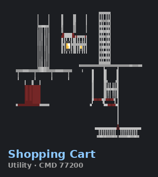 | `chassis` | YaP Chassis · CMD 77200 |
| 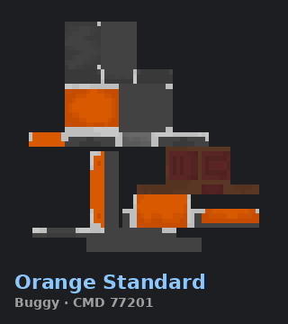 | `buggy` | Buggy · CMD 77201 |
| 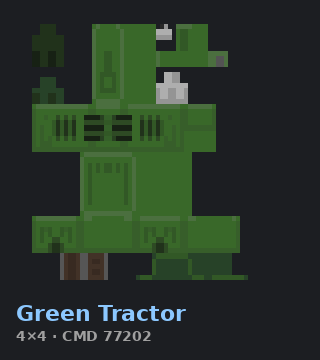 | `truck_4x4` | 4×4 Truck · CMD 77202 |
| 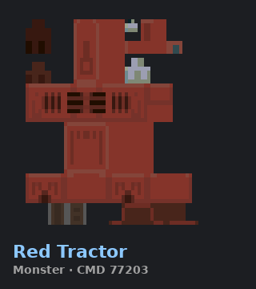 | `monster_truck` | Monster Truck · CMD 77203 |
| 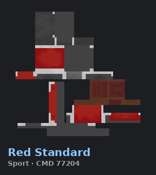 | `sport_car` | Sport Car · CMD 77204 |
| 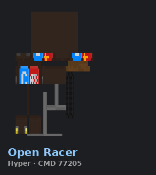 | `hypercar` | Open Racer · CMD 77205 |
| 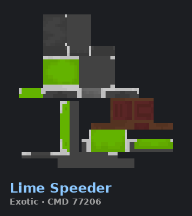 | `lambo` | Lime Speeder · CMD 77206 |
| 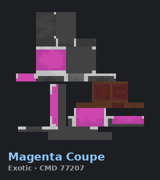 | `ferrari` | Magenta Coupe · CMD 77207 |
| 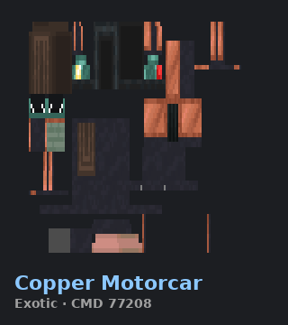 | `mclaren` | Copper Motorcar · CMD 77208 |
| 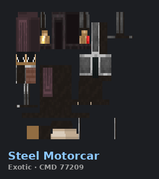 | `porsche` | Steel Motorcar · CMD 77209 |
| 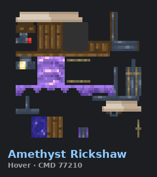 | `hoverbike` | Amethyst Rickshaw · CMD 77210 |

## Regenerate

```bash
python3 scripts/import-automobility-vehicles.py
# then re-run the showcase PNG block documented in CREDITS / import notes
```

See [VEHICLES.md](../../docs/plugins/VEHICLES.md) for spawn commands and physics.
